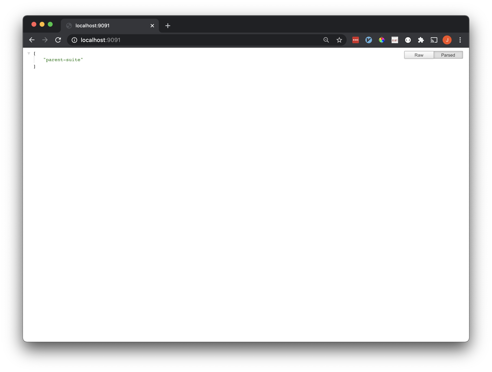

# gopher-jasmine
A runtime-available jasmine inspired acceptance test framework for golang.
## Quick Start
### Create A Suite and Serve
The following example creates a suite called `parent suite` which has one test `should run one top level test` and one child suite `first child suite`. The child suite has one test `should run one child test`.
The structure is more easily represented in the following way.
* parent suite
  * should run one top level test
  * first child suite
    * should run one child test
    
This suite is served at `localhost:9091`.
```golang
package main

import (
  "gopher-jasmine/api"
  "gopher-jasmine/suite"
)

func main() {
  s := suite.NewSynchronousSuite("parent suite").
          It("should run one top level test", func(instance map[string]interface{}) error {
            return nil
          }).
          Describe(suite.NewSynchronousSuite("first child suite").
                  It("should run one child test", func(instance map[string]interface{}) error {
                    return nil
                  }),
          )
  api.NewApi([]suite.Suite{s}).ListenAndServe(":9091")
}
```
### Run the Suite
All available API endpoints are listed at `localhost:9091`. 


To trigger the `parent suite` navigate to `localhost:9091/parent-suite`.

